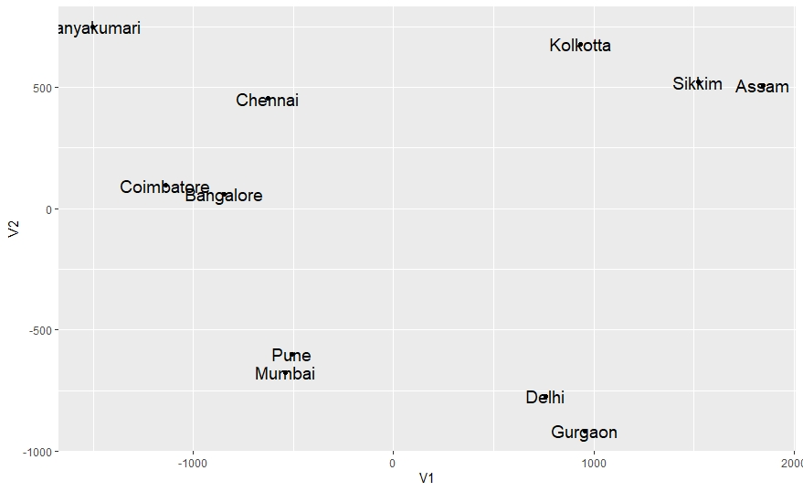

# Multidimensional Scaling

*Dataset contains distance between cities in India (in KM) and the dissimilarity index between different cities are calculated and plotted.*

*This provides a quick visual representation of which group of cities are closer to each other in terms of distance.*

*This analysis is much suitable to find the dissimilarities between different cities (or objects) when there are large number of dimensions because in such a case, it will be difficult to manually find out which group of cities (or objects) are close in terms of attributes and which are not. More or less we are finding out Cluster of objects based on dissimilarity index.* 

*This work can be extended to different scenarios like: User ratings of multiple products to find out which group of products or category of products get similar ratings from users.*

# Output

